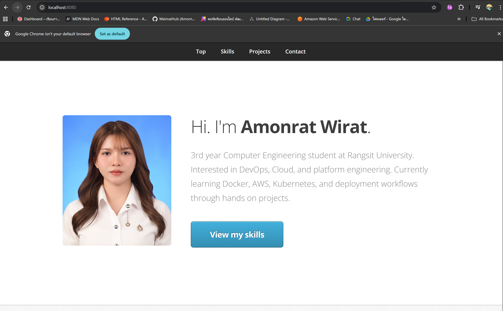

# Amonrat Portfolio (Docker)

This project demonstrates deploying a static HTML portfolio using Docker and Nginx.

## Architecture
Browser → Docker Container → Nginx → Static HTML

## Features
- Static HTML portfolio
- Docker container deployment
- Nginx web server
- Volume mounting
- Live reload when editing index.html

## Run
```bash
docker run -d -p 8080:80 -v $(pwd):/usr/share/nginx/html nginx
Open:
http://localhost:8080

## Screenshot



## Tech
- HTML / CSS / JavaScript
- Docker
- Nginx
- Git & GitHub
- Containerized Deployment
- Volume Mounting 